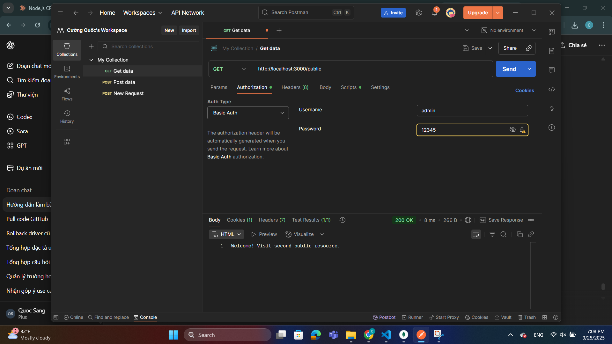
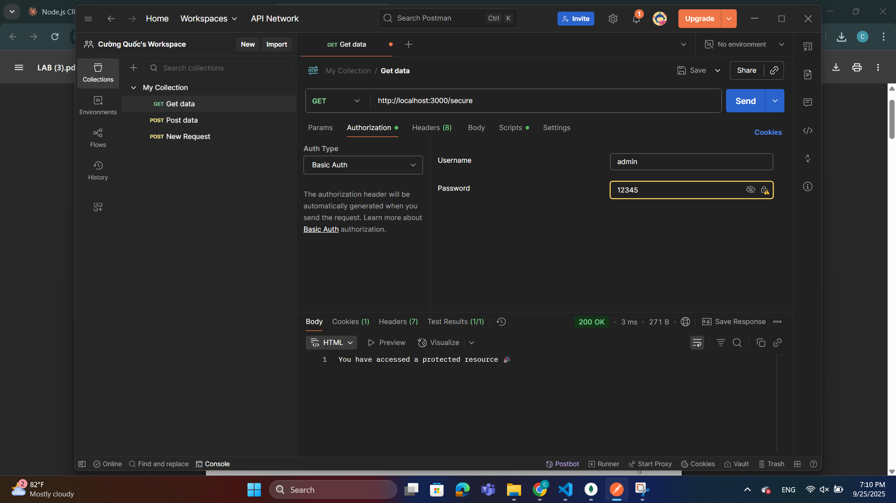
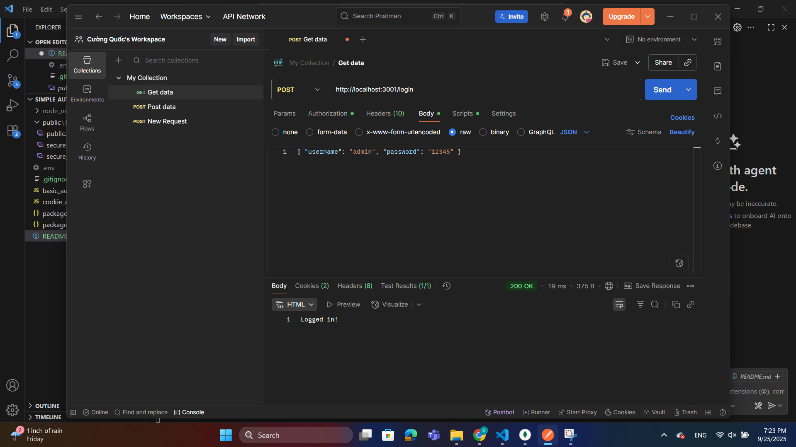
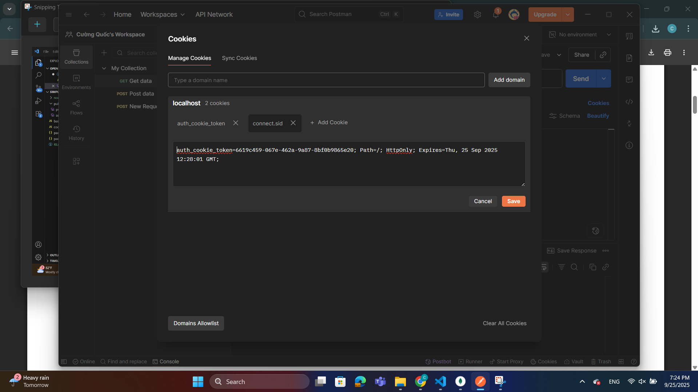
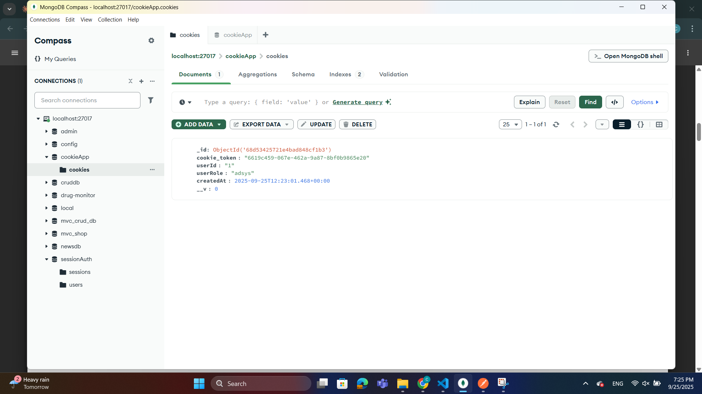
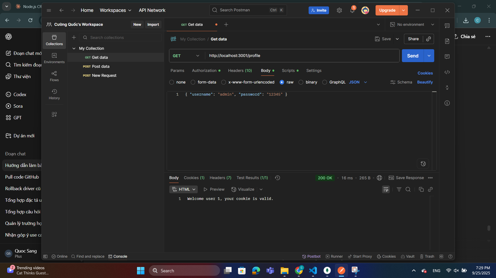
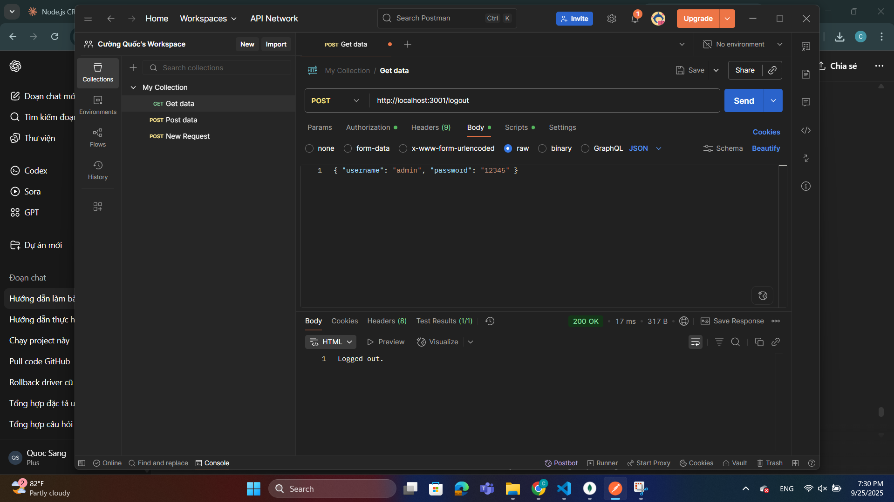

# Simple Auth

Dự án minh họa xác thực cơ bản (Basic Authentication) với Express.js.

---

1. Cài đặt package:

   npm install
2. Chạy server:
node basic_auth.js

Chạy server Cookie Auth:
node cookie_auth.js

3. Server chạy tại: http://localhost:3000

Test trên postMan
1. Với basic_auth.js

- GET /public → Trang public khác

- GET /secure → Yêu cầu xác thực Basic Auth
Username: admin
Password: 12345

+ Nếu đúng → You have accessed a protected resource 🎉

+ Nếu sai → 401 hoặc 403

2. Test Postman Với cookie_auth.js

- POST /login
Body:

{
  "username": "admin",
  "password": "12345"
}

Kết quả: "Logged in!" + cookie auth_cookie_token được tạo và lưu vào MongoDB.

cookie postman:

cookie MongoDB: 

- GET /profile
Chỉ truy cập được khi cookie auth_cookie_token còn hợp lệ.
Trả về: Welcome user 1, your cookie is valid.

- POST /logout
Xóa cookie trong DB + clear cookie trên client.
Kết quả: "Logged out."

